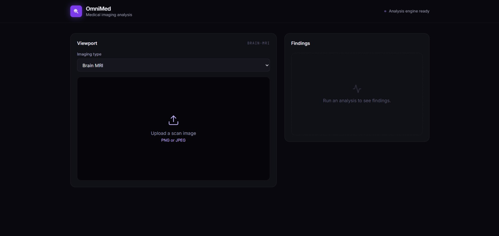
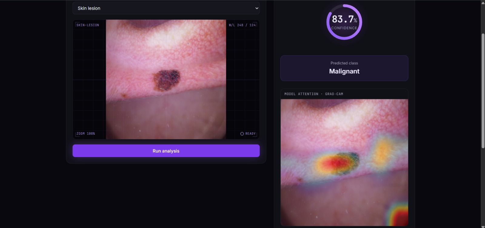
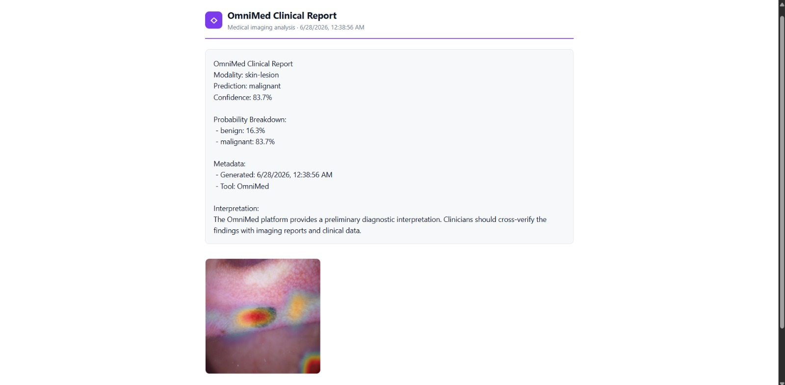

# OmniMed — Multi-Modality Medical Imaging Analysis Platform

OmniMed is an end-to-end deep-learning platform that classifies medical images across **three different imaging modalities** — brain MRI, chest X-ray, and skin lesion — and explains every prediction with a Grad-CAM attention map and an on-demand clinical report.

It is built as a **platform, not three separate apps**: a single modular FastAPI backend serves all modalities through one shared prediction pipeline, and a single Next.js workstation UI switches between them.

> **Disclaimer:** OmniMed is an educational / portfolio demonstration of an end-to-end medical-imaging ML pipeline. It is **not** a medical device and must not be used for diagnosis or clinical decision-making.

---

## Demo

> _Add your screenshots here (replace the paths below)._

| Workstation UI | Grad-CAM explainability | Generated report |
|---|---|---|
|  |  |  |

---

## What it does

- **Three imaging modalities**, each backed by a trained model:
  - **Brain MRI** — 4-class tumor typing (glioma / meningioma / no-tumor / pituitary)
  - **Chest X-ray** — pneumonia detection (normal / pneumonia)
  - **Skin lesion** — malignancy screening (benign / malignant)
- **Grad-CAM explainability** — every prediction returns a heatmap, colorized and overlaid on the original scan, showing *where* the model looked.
- **On-demand clinical report** — a structured report (prediction, per-class probabilities, clinician notes, interpretation) generated from the live result and exportable to PDF.
- **Confidence-aware UI** — radial confidence gauge, per-class probability bars, and an automatic low-confidence flag recommending manual review.

---

## Results

All models are EfficientNet-B0 backbones, transfer-learned then fine-tuned, evaluated on held-out test sets.

| Modality | Task | Classes | Test Accuracy |
|---|---|---|---|
| Brain MRI | Tumor typing | 4 | **70.1%** |
| Chest X-ray | Pneumonia detection | 2 | **89.7%** |
| Skin lesion | Malignancy screening | 2 | **86.2%** |

**Per-class detail**

Brain MRI (4-class — the hardest task; glioma vs. meningioma is genuinely difficult):

| Class | Precision | Recall | F1 |
|---|---|---|---|
| glioma | 0.727 | 0.240 | 0.361 |
| meningioma | 0.667 | 0.870 | 0.755 |
| no-tumor | 0.706 | 0.962 | 0.815 |
| pituitary | 0.750 | 0.689 | 0.718 |

Chest X-ray:

| Class | Precision | Recall | F1 |
|---|---|---|---|
| normal | 0.921 | 0.795 | 0.853 |
| pneumonia | 0.886 | 0.959 | 0.921 |

Skin lesion:

| Class | Precision | Recall | F1 |
|---|---|---|---|
| benign | 0.877 | 0.869 | 0.873 |
| malignant | 0.845 | 0.853 | 0.849 |

> Note the **clinically sensible error profile**: both screening models (chest, skin) favour high recall on the dangerous class (pneumonia recall 0.96, malignant recall 0.85) — i.e. they err toward catching positives rather than missing them.

Confusion matrices: `docs/confusion_matrix_brain.png`, `docs/confusion_matrix_chest.png`, `docs/confusion_matrix_skin.png`.

---

## Architecture

The core design goal is a **platform abstraction that generalizes across modalities**.

```
                ┌────────────────────────────────────────┐
   POST         │              FastAPI backend           │
 /api/predict/  │                                        │
 {modality} ───▶│  factory.get_handler(modality)         │
                │        │                               │
                │        ▼                               │
                │   BaseHandler.predict()  ◀── shared pipeline (defined ONCE)
                │     load image → preprocess            │
                │     load model (cached, lazy)          │
                │     classify → probabilities           │
                │     Grad-CAM → overlay                 │
                │        │                               │
                │        ▼                               │
                │   PredictionResponse (JSON)            │
                └────────────────────────────────────────┘
```

**Key design decisions**

- **Shared pipeline, config-only handlers.** The entire predict pipeline lives once in `BaseHandler`. Each concrete handler is ~6 lines of configuration:
  ```python
  class BrainMRIHandler(BaseHandler):
      modality = "brain-mri"
      display_name = "Brain MRI"
  ```
  Adding a modality = add a config entry + a 3-line handler + register it in the factory. No duplicated logic.
- **Registry / factory pattern** maps a modality string to its handler, with a single source of truth for labels and input sizes in `constants.py`.
- **Graceful degradation.** The model loader caches models lazily and returns `None` (→ HTTP 503) instead of crashing if a model or TensorFlow is unavailable, so the server stays up.
- **Training/serving consistency.** EfficientNet performs its own input normalization internally, so both training and inference feed raw 0–255 pixels (no double-rescaling) — a subtle bug class this project explicitly avoids.

---

## Engineering highlights — diagnosis & iteration

This project was brought from a non-working baseline to a reliable state through systematic debugging. A few representative problems I diagnosed and fixed:

- **A model that "predicted everything as the same class."** The brain MRI model returned near-uniform ~25% probabilities for every input. By reproducing the behaviour I traced it to **double normalization** — inputs were divided by 255 before an EfficientNet that already rescales internally, collapsing every image toward zero. Removing the redundant step restored meaningful outputs.
- **Underfitting hidden behind a confusion matrix.** Even with correct inputs the model was biased toward easy classes and effectively blind to glioma (recall ≈ 0). The confusion matrix pointed to a **frozen ImageNet backbone underfitting an out-of-distribution domain.** A two-phase fine-tuning schedule (frozen head → unfrozen top blocks at low LR) lifted overall accuracy from **56% → 70%** and recovered glioma from a non-functional class.
- **Grad-CAM that broke on the retrained model.** Explainability failed with a graph-disconnected / "no Conv2D layer" error because the new model nested EfficientNet as a sub-model. I reworked Grad-CAM to run the backbone, watch its feature map with a gradient tape, and re-apply the head — making it robust to both nested and flat architectures.
- **Collapsing duplicated handlers into a real abstraction.** The three modality handlers were ~95% identical copy-paste. I lifted the shared pipeline into `BaseHandler`, reducing each handler to a few lines of config and making the platform genuinely extensible.

The throughline is **diagnosis** — reproduce a symptom, form a hypothesis, verify the fix — rather than assembling parts that already worked.

---

## Training methodology

Each model uses the same reproducible recipe (`ai-core/train_*.py`):

1. **Phase 1 — frozen backbone.** Train a classification head on a frozen ImageNet EfficientNet-B0.
2. **Phase 2 — fine-tuning.** Unfreeze the top ~30% of the backbone and continue at a low learning rate (1e-5). BatchNorm layers stay frozen (standard EfficientNet practice, preserving pretrained statistics).
3. **Class weighting** to handle dataset imbalance.
4. **Augmentation** tuned per modality (e.g. no vertical flips for brain MRI to preserve anatomical orientation; vertical flips allowed for skin lesions).

Datasets: Kaggle Brain Tumor Classification, Chest X-Ray Images (Pneumonia), and Skin Cancer (Malignant vs Benign).

---

## Tech stack

- **ML:** TensorFlow / Keras, EfficientNet-B0 (transfer learning + fine-tuning), Grad-CAM
- **Backend:** FastAPI, Pydantic, Uvicorn
- **Frontend:** Next.js, React, TypeScript, Tailwind CSS
- **Tooling:** Docker Compose, scikit-learn (metrics)

---

## Project structure

```
neuroscan-ai/
├── ai-core/                 # training scripts
│   ├── train_brain_mri.py
│   ├── train_chest_xray.py
│   └── train_skin_lesion.py
├── backend-api/
│   ├── app/
│   │   ├── api/             # predict / report / health routes
│   │   ├── handlers/        # base_handler + per-modality config handlers
│   │   ├── services/        # model_loader, report_service
│   │   ├── utils/           # image preprocessing, gradcam
│   │   ├── core/            # config
│   │   ├── constants.py     # single source of truth: labels, input sizes
│   │   ├── schemas.py
│   │   └── main.py
│   └── models/              # trained .h5 models
├── frontend-ui/             # Next.js app (page.tsx, globals.css)
└── docker-compose.yml
```

---

## Running locally

**Backend**
```bash
cd backend-api
pip install -r requirements.txt
uvicorn app.main:app --reload
# API at http://127.0.0.1:8000  (docs at /docs)
```

**Frontend**
```bash
cd frontend-ui
npm install
npm run dev
# UI at http://localhost:3000
```

Place trained models in `backend-api/models/` (`chest_xray_classifier.h5`, `skin_lesion_classifier.h5`) and the brain model at the backend root (`brain_tumor_efficientnet.h5`). Train your own with the scripts in `ai-core/`.

---

## Known limitations (and how I'd address them)

Being explicit about these, because they matter:

- **Brain glioma recall is low (0.24).** Gliomas are the hardest class and are most often confused with meningioma. Fixable with deeper fine-tuning / more glioma data, at some risk to the other classes — deliberately kept conservative here.
- **Chest X-ray dataset bias.** Grad-CAM shows the model sometimes attends to non-lung regions (shoulders, image borders) — a documented failure mode of chest-X-ray CNNs. A lung-field crop in preprocessing would mitigate it.
- **No "none of the above" class.** Like any classifier, a model forced an out-of-distribution image (e.g. a skin photo in brain-MRI mode) will still pick a class. Input-type validation is a planned guard.
- **Not clinically validated.** Trained on public datasets for demonstration only.

## Future work

- Real tumor **segmentation** (U-Net) for brain MRI using a mask-labeled dataset.
- Input-modality validation to reject mismatched images.
- Live deployment + automated test suite + CI.
